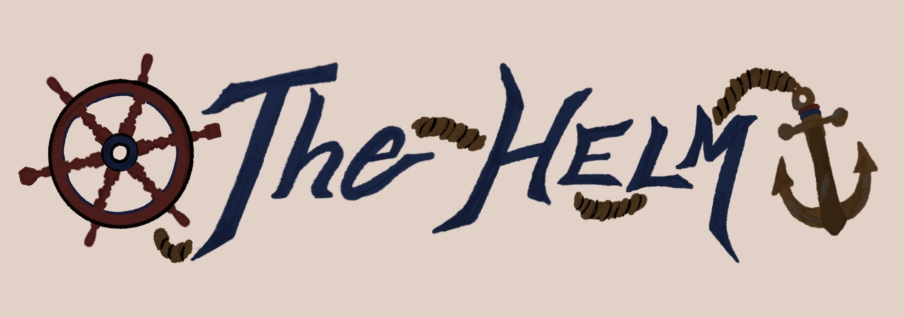

# Helm - Torrent Automation Prototype

<div>
<p align="center">
  
</p>
</div>
<hr>
<br>

## Table of Contents

- [Why this exists ](#why-this-exists)
- [Roadmap](#roadmap)
- [Configuration](#configuration)
- [Usage (WIP)](#usage-wip)
- [Disclaimer](#disclaimer)
- [Contributing](#contributing)
- [How it Works (High-Level)](#how-it-works-high-level)
- [Known Limitations](#known-limitations)
- [Credits](#credits)
- [License](#license)

**Current State:** Prototype

Helm is a CLI-based torrent automation tool designed to fetch, filter, and send magnet links to qBittorrent. Currently, the project is in a prototype stage. To fully operate, it requires a few

## external services:

- **Flaresolverr** (run via Docker image)
- **Jackett** (as a service)
- **qBittorrent-nox** (headless torrent client)

Later, I plan to publish my own indexer files for easier setup so hell yeah?!.

---

## Features (Planned / Prototype)

1. Load and save configuration (.env and JSON)
2. Add indexers and build RSS URLs
3. Fetch and parse RSS feeds
4. Deduplicate, filter, and sort torrents
5. Send magnet links automatically to qBittorrent

---

## Dependencies

### Fedora / RHEL

```bash
sudo dnf install qbittorrent-nox
```

### Debian / Ubuntu

```bash
sudo apt install qbittorrent-nox
```

> Note: Jackett and Flaresolverr must be installed and configured separately before running Helm.

## Installation

```bash
# Clone the repo
git clone https://github.com/Piratebird/helm.git
cd helm

# Create a virtual environment
python3 -m venv venv
source venv/bin/activate  # Linux/macOS
# venv\Scripts\activate   # Windows

# Install dependencies
pip install -r requirements.txt

```

<br>

## Why this exists

Honestly for the most part it's for myself and my own usage i wanted to get magnets of torrents and shows and it was annoying sometimes to look all over the internet for a torrent so i wanted to do that but with the terminal for the most part and heck yeah it gets the job done so far it's not perfect but it's my own so hell yeah :)

## Roadmap

Helm is actively roaming the 7seas and trying to get more treasures:

- Bash installer.
- Improved qBittorrent integration.
- Interactive configurations.
- Scrumptious TUI interface.
- Better indexer management.

For more detailed tasks breakdown check [TODO.md](TODO.md)

## Configuration

Helm uses a combo of env variables and JSON configuration files.

What these do:

- Indexer configuration
- RSS feed URLs
- Filtering and deduplication behavior.
- qBittorrent connection details,

Will see how the configuration changes based on the state of the project/its version.

## Usage (WIP)

Helm is currently run from the CLI.

Typical workflow:

1. Configure indexers and credentials via environment variables / JSON files.
2. Run helm to fetch RSS feeds.
3. Matching torrents are filtered and sent to qBittorrent automatically.

More detailed usage instructions will be added as the project stablize so hang in there :<

## Disclaimer

Helm does **NOT** host, distribute, or provide any copyrighted content.

This tool simply automates (kinda) the process of fetching RSS feeds and sending magnet links to a torrent client.

However you use this tool is your responsibility gangster.

## Contributing

Contributions are welcome especially but not limited to bug fixes, refactors or doumenation improvements.

If you plan to add a major feature or change behavior, it's prolly a good idea to open an issue.

with that out the way this project is real close to me since it's my official first project so let's make this bozo go (perchance).

## How it works (high-level)

Helm pulls torrent RSS feeds from configured indexers, applies filtering and deduplication rules, and automatically sends matching magnet links to qBittorrent.

Note: Most configuration is handled through environment variables and JSON files.

## Known limitations

- Project is still in early prototype stage.
- Configuration format could change.
- Error handeling maybe minimal in some areas here and there.
- Not extensively tested on all platforms.

## Credits

shoutout to the goats (this project is built with these open-source tools btw) qBittorrent, Jackett, and Flaresolverr.

## License

This project is licensed under the GPL License.
See the [LICENSE](LICENSE) file for details.
